# Tugas 1

- Jalankan program server.py di 3 port yang berbeda (31000, 31001, 31002)  
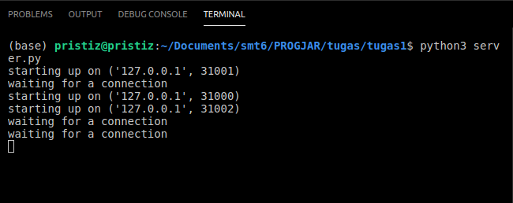
- Jalankan program client.py untuk konek ke server yang jalan pada poin sebelumnya dan mengirimkan string “PEMROGRAMAN JARINGAN TEKNIK INFORMATIKA”  
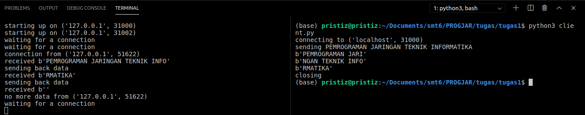

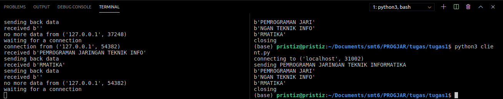
- Jalankan program server.py di 3 port yang berbeda di 2 komputer yang berbeda  
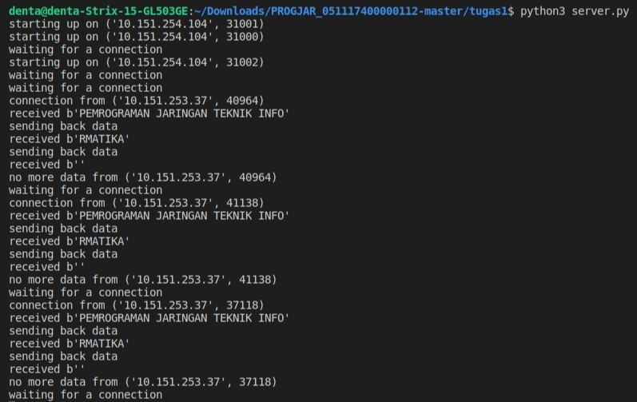
- Jalankan program client.py untuk konek ke server pada poin sebelumnya, kirimkan string yang sama  
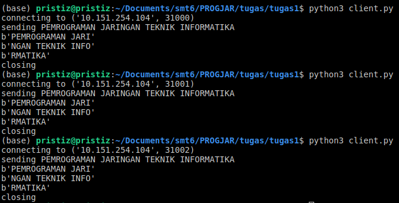
- MODIFIKASILAH program client.py dan server.py agar dapat MENTRANSFER file dari client ke server (letakkan program modifikasi di direktori tugas1a)  
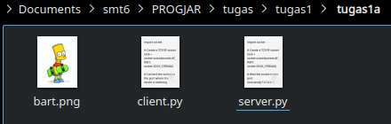
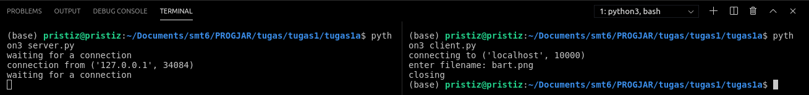
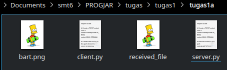
- MODIFIKASILAH program server.py agar dapat mengirimkan MENTRANSFER FILE yang di request oleh client (letakkan program modifikasi di direktori tugas1b)  
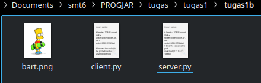
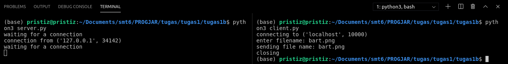
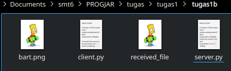
