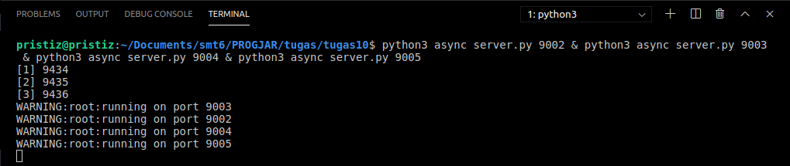
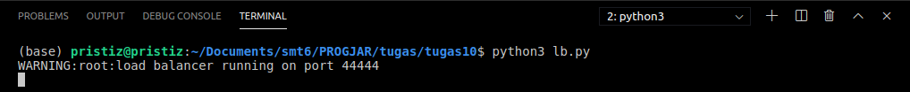
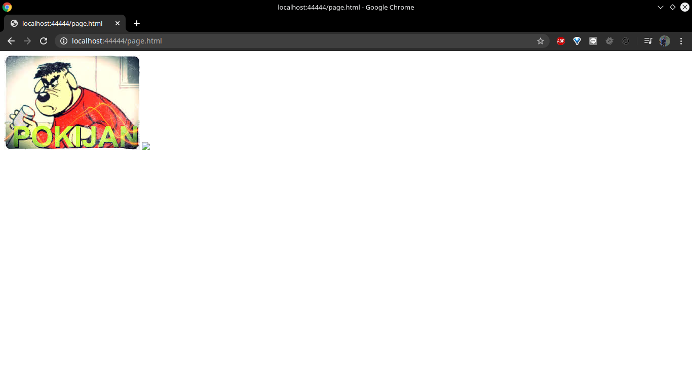
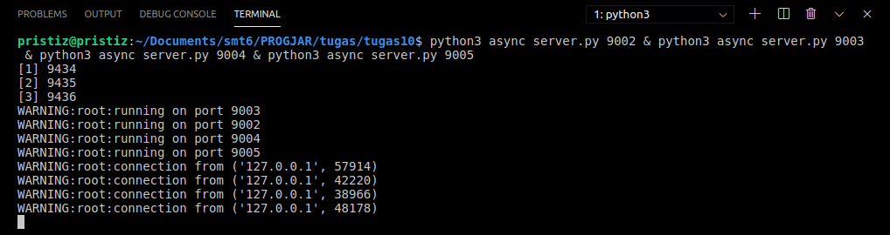
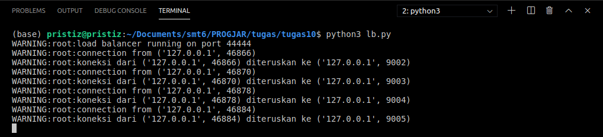

# Tugas 10

- Jalankan `async_server.py` pada port 9002, 9003, 9004, 9005  
  
- Jalankan file `lb.py`, jalankan di port 44444  
  
- Jalankan browser, akseslah `http://localhost:44444/page.html`  
  
- Lihatlah di log program, bahwa setiap request akan dilayani oleh backend yang bergantian  
  
  
- Lakukan performance test  
  [Screenshot `async_server.py`](https://htmlpreview.github.io/?https://github.com/pizzaismyname/PROGJAR_051117400000112/blob/master/tugas10/screenshot/async_server.html)  
- Tabel hasil performance test [async_server.py](../tugas10/async_server.py)  
  tabel disini
