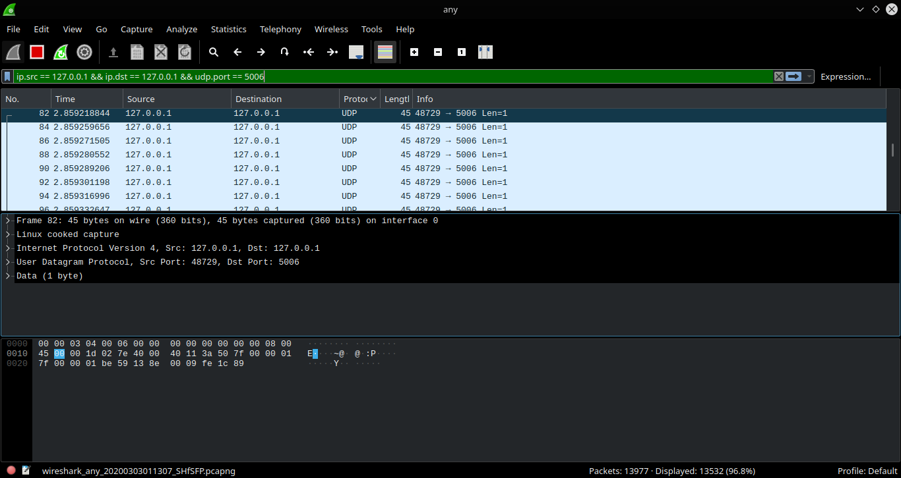
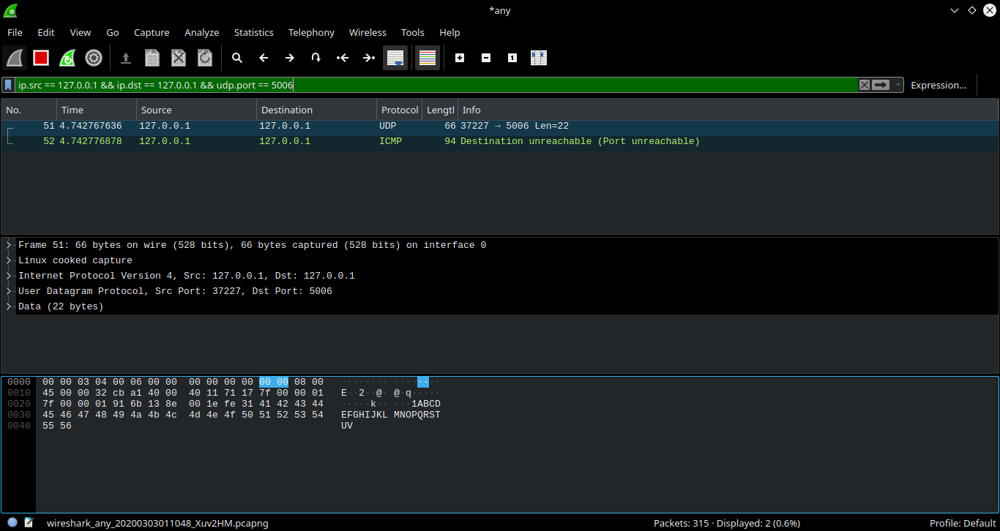
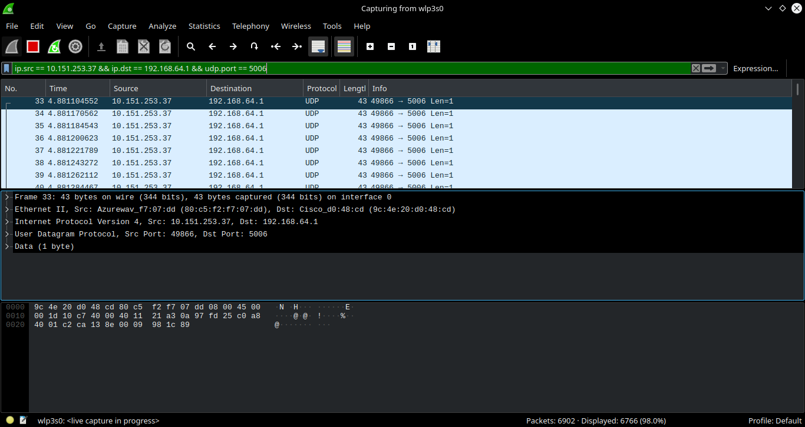
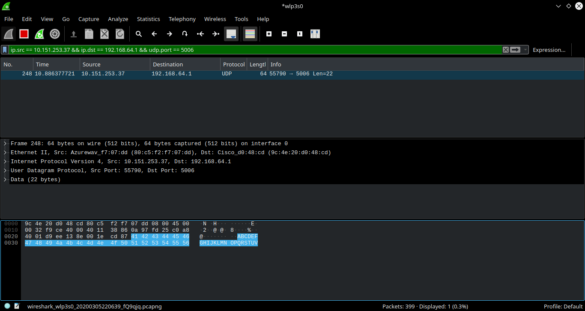

# Tugas 2

- Capture hasil keluaran dari program udpfileclient.py ke alamat 127.0.0.1 ke port 5006  

- Capture hasil keluaran dari program udp_simple.py ke alamat 127.0.0.1 di port 5006  

- Capture hasil keluaran dari program udpfileclient.py ke alamat komputer lain (192.168.64.1) ke port 5006  

- Capture hasil keluaran dari program udp_simple.py ke alamat komputer lain (192.168.64.1) di port 5006  

