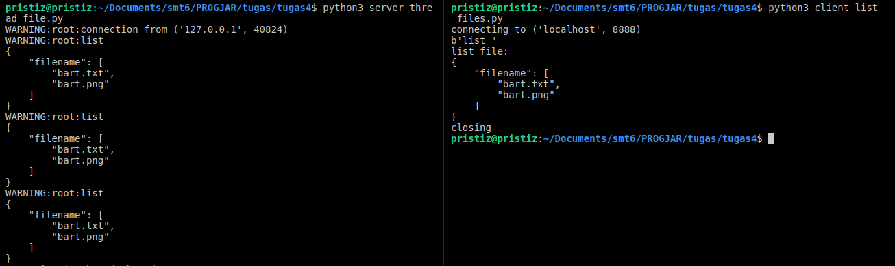

# Tugas 4

## Dokumentasi Protokol

### Ketentuan membaca format

string terbagi menjadi 2 bagian, dipisahkan oleh spasi
COMMAND [spasi] PARAMETER [spasi] PARAMETER ...

### Daftar Fitur

> Berisi penjelasan mengenai:
> - Cara melakukan request
> - Apa respon yang didapat

1. Meletakkan file
    * Request: `upload`
    * Parameter: namafile [spasi] isifile
    * Response:
        * Berhasil -> `OK`
        * Gagal -> `ERROR`
1. Mengambil file
    * Request: `download`
    * Parameter: namafile
    * Response: isi file dalam bentuk base64encode format
1. Melihat list file
    * Request: list
    * Parameter: tidak ada
    * Response: daftar nama file yang ada pada folder `files` dalam bentuk *json* format
1. Jika _command_ tidak dikenali akan merespon dengan `ERRCMD`

## Laporan

- Protokol untuk *meletakkan file*  
File yang akan diupload adalah `bart.png` dan `bart.txt`:  
  
Kondisi folder `files` sebelum program dijalankan:  
  
Menjalankan `server_thread_file.py` dan `client_upload_file.py`:  
  
Kondisi folder `files` setelah program dijalankan (file `bart.png` dan `bart.txt` berhasil diupload):  
  
- Protokol untuk *mengambil file*  
File yang akan didownload adalah `bart.png` dan `bart.txt`:  
  
Kondisi folder sebelum program dijalankan:  
  
Menjalankan `server_thread_file.py` dan `client_download_file.py`:  
  
  
Kondisi folder setelah program dijalankan (file `bart.png` dan `bart.txt` berhasil didownload):  
  
- Protokol untuk *melihat isi file*  
Kondisi folder `files` saat ini (terdapat file `bart.png` dan `bart.txt`):  
  
Menjalankan `server_thread_file.py` dan `client_list_files.py` (program berhasil menampilkan list file pada folder `files`):  
  
