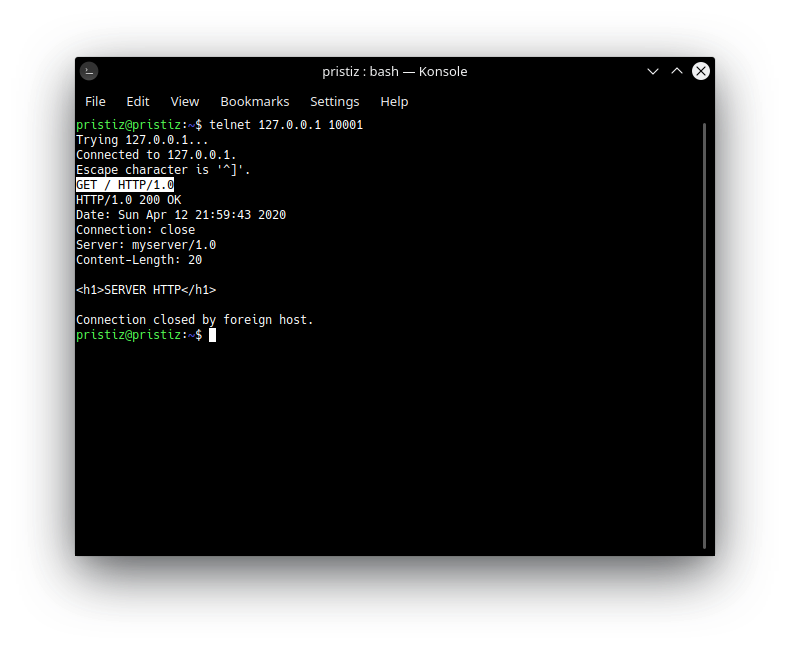
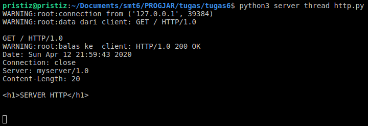
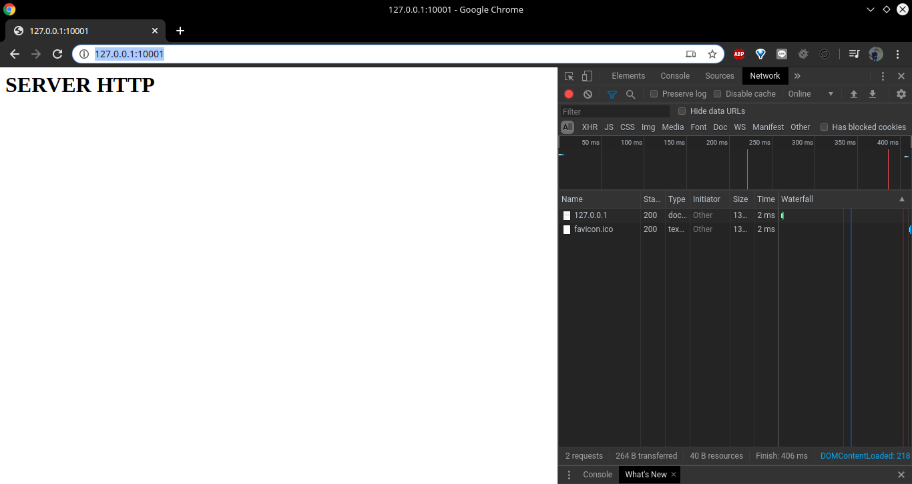
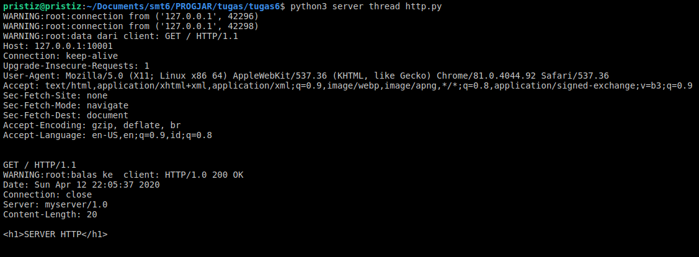
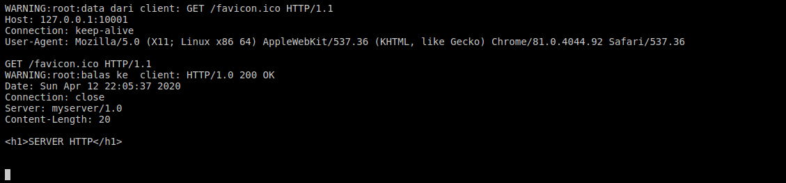

# Tugas 6

- Cobalah dengan telnet pada port 10001, dengan cara mengirimkan string `GET / HTTP/1.0`  

Respons server:

- Bukalah chrome web browser, aktifkan developer mode, bagian network, dan bukalah alamat `http://127.0.0.1:10001`  

Respons server:

