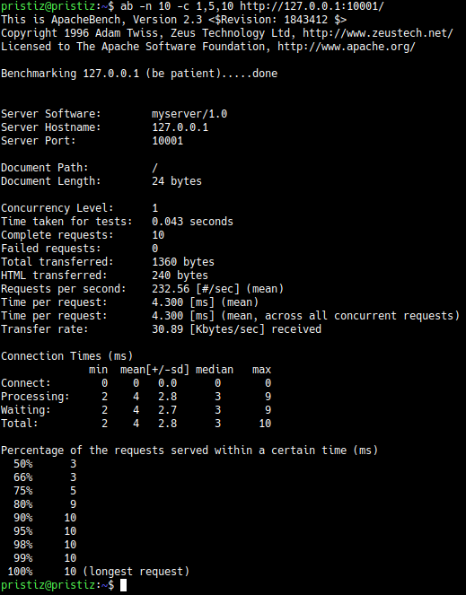
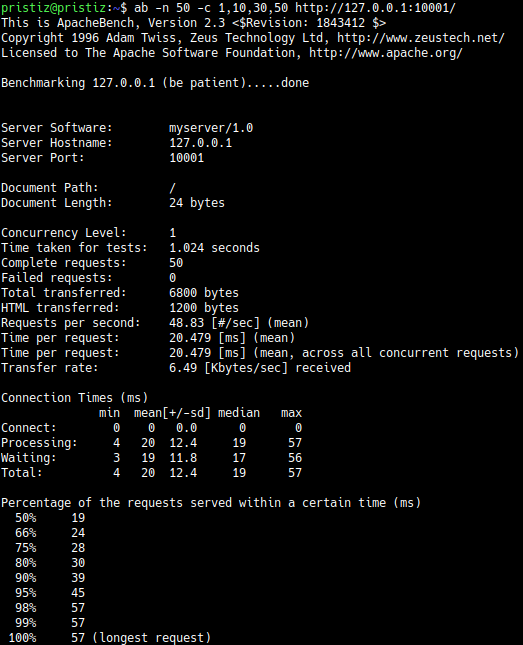
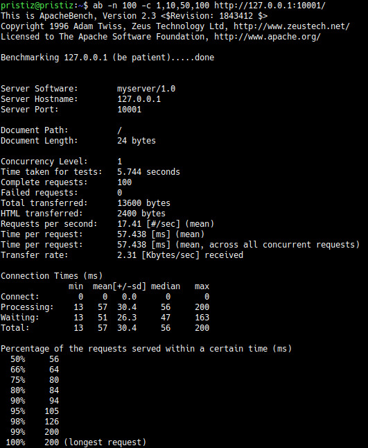

# Tugas 7

## Performance Test

### Keluaran Hasil

| No test | Concurrency level | Time taken for test (seconds) | Complete request | Failed request | Total transferred (bytes) | Request per second | Time per request (ms) | Transfer rate (Kbytes/sec) |
|:-------:|:-----------------:|:-----------------------------:|:----------------:|:--------------:|:-------------------------:|:------------------:|:---------------------:|:--------------------------:|
|    1    |         1         |             0.043             |        10        |        0       |            1360           |       232.56       |         4.300         |            30.89           |
|    2    |         1         |             1.024             |        50        |        0       |            6800           |        48.83       |         20.479        |            6.49            |
|    3    |         1         |             5.744             |        100       |        0       |           13600           |        17.41       |         57.438        |            2.31            |

### Screenshot

- `ab -n 10 -c 1,5,10 http://127.0.0.1:10001/`  

- `ab -n 50 -c 1,10,30,50 http://127.0.0.1:10001/`  

- `ab -n 100 -c 1,10,50,100 http://127.0.0.1:10001/`  

