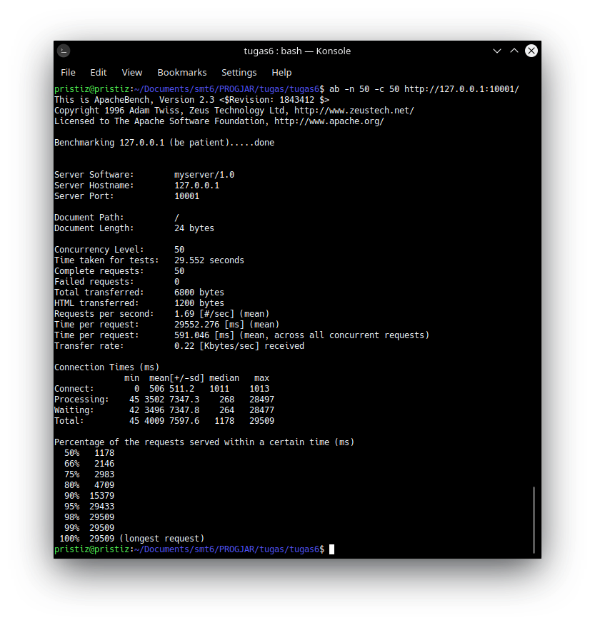

# Tugas 7

## Performance Test

[Server yang ditest](../tugas6/server_thread_http.py)

### Keluaran Hasil

<table>
  <tr>
    <th>No test </th>
    <th>Concurrency level </th>
    <th>Time taken for test (seconds)</th>
    <th>Complete request </th>
    <th>Failed request </th>
    <th>Total transferred (bytes)</th>
    <th>Request per second </th>
    <th>Time per request (ms)</th>
    <th>Transfer rate (Kbytes/sec)</th>
  </tr>
  <tr>
    <td rowspan="3">1</td>
    <td>1</td>
    <td>0.099</td>
    <td>10</td>
    <td>0</td>
    <td>1360</td>
    <td>100.61</td>
    <td>9.939</td>
    <td>13.36</td>
  </tr>
  <tr>
    <td>5</td>
    <td>0.073</td>
    <td>10</td>
    <td>0</td>
    <td>1360</td>
    <td>137.17</td>
    <td>36.450</td>
    <td>18.22</td>
  </tr>
  <tr>
    <td>10</td>
    <td>0.080</td>
    <td>10</td>
    <td>0</td>
    <td>1360</td>
    <td>124.37</td>
    <td>80.405</td>
    <td>16.52</td>
  </tr>
  <tr>
    <td rowspan="4">2</td>
    <td>1</td>
    <td>1.064</td>
    <td>50</td>
    <td>0</td>
    <td>6800</td>
    <td>46.99</td>
    <td>21.279</td>
    <td>6.24</td>
  </tr>
  <tr>
    <td>10</td>
    <td>1.479</td>
    <td>50</td>
    <td>0</td>
    <td>6800</td>
    <td>33.81</td>
    <td>295.774</td>
    <td>4.49</td>
  </tr>
  <tr>
    <td>30</td>
    <td>7.732</td>
    <td>50</td>
    <td>0</td>
    <td>6800</td>
    <td>6.47</td>
    <td>4639.134</td>
    <td>0.86</td>
  </tr>
  <tr>
    <td>50</td>
    <td>29.552</td>
    <td>50</td>
    <td>0</td>
    <td>6800</td>
    <td>1.69</td>
    <td>29552.276</td>
    <td>0.22</td>
  </tr>
  <tr>
    <td rowspan="4">3</td>
    <td>1</td>
    <td>10.979</td>
    <td>100</td>
    <td>0</td>
    <td>13600</td>
    <td>9.11</td>
    <td>109.787</td>
    <td>1.21</td>
  </tr>
  <tr>
    <td>10</td>
    <td>7.792</td>
    <td>100</td>
    <td>0</td>
    <td>13600</td>
    <td>12.83</td>
    <td>779.210</td>
    <td>1.70</td>
  </tr>
  <tr>
    <td>50</td>
    <td>0.624</td>
    <td>100</td>
    <td>0</td>
    <td>13600</td>
    <td>160.38</td>
    <td>311.761</td>
    <td>21.30</td>
  </tr>
  <tr>
    <td>100</td>
    <td>0.724</td>
    <td>100</td>
    <td>0</td>
    <td>13600</td>
    <td>138.10</td>
    <td>724.138</td>
    <td>18.34</td>
  </tr>
</table>

### Screenshot

- `ab -n 10 -c 1 http://127.0.0.1:10001/`  

- `ab -n 10 -c 5 http://127.0.0.1:10001/`  

- `ab -n 10 -c 10 http://127.0.0.1:10001/`  

- `ab -n 50 -c 1 http://127.0.0.1:10001/`  

- `ab -n 50 -c 10 http://127.0.0.1:10001/`  

- `ab -n 50 -c 30 http://127.0.0.1:10001/`  

- `ab -n 50 -c 50 http://127.0.0.1:10001/`  

- `ab -n 100 -c 1 http://127.0.0.1:10001/`  

- `ab -n 100 -c 10 http://127.0.0.1:10001/`  

- `ab -n 100 -c 50 http://127.0.0.1:10001/`  

- `ab -n 100 -c 100 http://127.0.0.1:10001/`  

