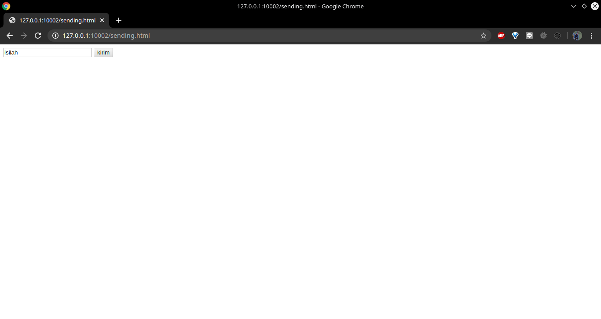
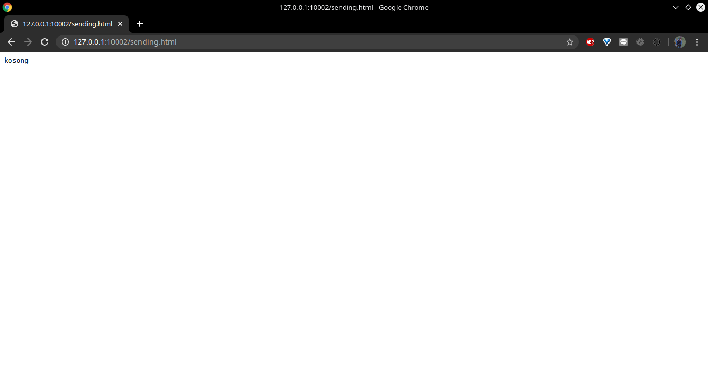
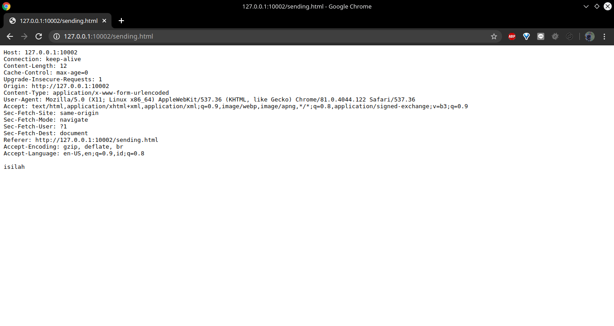
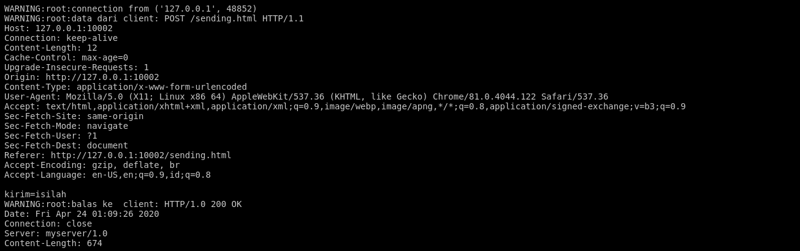
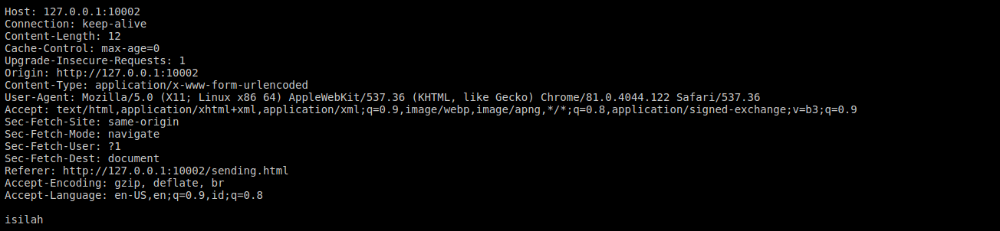

# Tugas 8

- Bukalah browser arahkan ke `http://127.0.0.1:10002/sending.html`, isilah dengan sesuatu dan kirim  
  
Keluaran:
  
- Modifikasilah agar server dapat membalas dengan isi
  - semua  header yang dikirim dari browser
  - Yang anda isikan di form pada saat mengisi pada poin nomor 5, misalkan mengisi “ISILAH” maka server akan mereply dengan “ISILAH” juga , dan bukan ‘kosong’
  
  
Keluaran:
  
Respons server:
  
  
